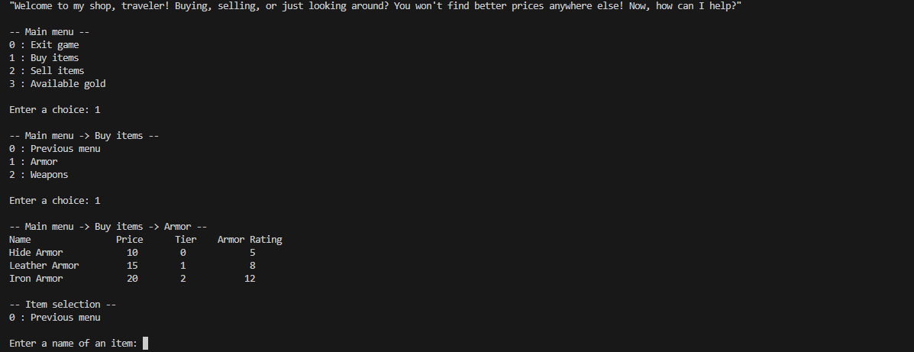

## Introduction
Module for simulating a trading interaction with a vendor. There is no graphical user interface, only text-based presentation.
The main functionality is the interaction between a vendor and a user (player) to buy and sell items.

## Functionality
- Items are predefined, but can be manually edited by the player in their respective .csv files. There are separate files for Armor and Weapons. These files can be therefore manipulated externally to add or remove items.
- Module 'classes' serves as blueprint module for classes of different items (Gold, Armor and Weapons).
- Armor and Weapons Class Objects inherit attributes from the parent Item class: name, price, tier. Both child classes also add their own attributes: Armor adds armor_rating and Weapons add their min_damage and max_damage.
- The 'vendor' module takes all the prewritten entries from .csv files, runs them through 'classes' and creates dictionaries for respective items.
- Vendor dictionaries contain all the items given by .csv files as Class Objects, under the key of the name of the item. Dictionaries are also separated for Armor and Weapons.
- With this setup, the 'vendor' module serves as a base shop where the player can buy and sell items.
- The 'inventory' module has its own dictionaries for Armor and Weapons, where the player owned items are stored. It also has all the main functions to manipulate these items (buy_...() and sell_...()).
- Module 'inventory' also manipulates vendor's and player's gold according to the transaction taking place.
- Trading happens through the 'trade' module, which contains the main written user interface and calls relevant functions based on the player's input.
- The input is protected, so if the player enters a wrong input, the module doesn't raise an error, but rather reminds the player of only allowed inputs.
- Module 'main' starts the code and the interaction.

## Installation
No installation. Run the code in main.py. The program starts automatically through the trade.trade() function.
IMPORTANT: Variable default_path in the 'vendor' module must be set to the directory where the .csv files are located on the computer.